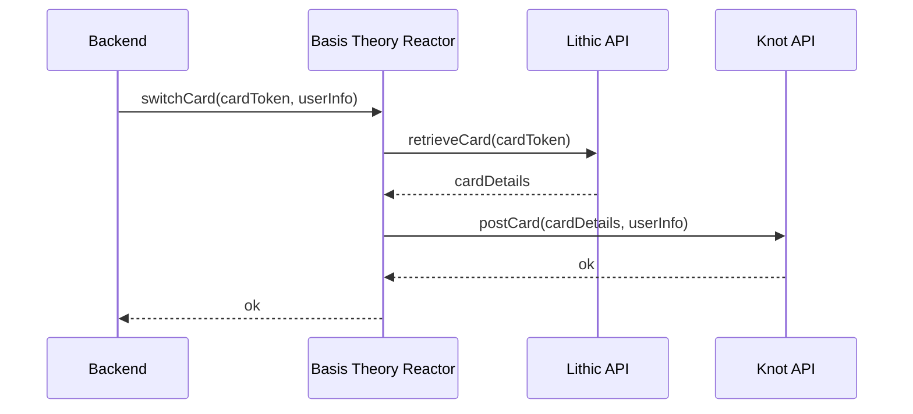

# Lithic / Knot Example

This repository shows how to use a [Reactor](https://developers.basistheory.com/docs/concepts/what-are-reactors) to [retrieve card details from Lithic](https://docs.lithic.com/docs/cards#get-specific-card) forward it to 
[Knot Card Swap API](https://docs.knotapi.com/docs/card).



## Terraform

Create a new `terraform.tfvars` file based off `terraform.tfvars.example`, replace the necessary values.

The `bt_management_api_key` should have `application:*` and `reactor:*` permissions. [Click here](https://portal.basistheory.com/applications/create?permissions=application%3Acreate&permissions=application%3Aread&permissions=application%3Aupdate&permissions=application%3Adelete&permissions=reactor%3Acreate&permissions=reactor%3Aread&permissions=reactor%3Aupdate&permissions=reactor%3Adelete&type=management&name=Terraform) to create a new management application using the Portal.

Create resources using:

```shell
terraform apply
```

It should give you two outputs:

```text
backend_application_key = <sensitive>
knot_reactor_id = "124da2af-afef-45d3-9850-4f017dece05d"
```

## Invoking the Reactor

Using the outputs from the previous step, [invoke](https://developers.basistheory.com/docs/api/reactors/#invoke-a-reactor) the Reactor using:

```shell
curl -L 'https://api.basistheory.com/reactors/{{knot_reactor_id}}/react' \
-H 'Content-Type: application/json' \
-H 'Accept: application/json' \
-H 'BT-API-KEY: {{backend_application_key}}' \
-d '{
    "args": {
        "lithicCardToken": "0fb6a486-9743-417c-80a1-ba57ed361f7b",
        "user": {
            "name": {
                "first_name": "John",
                "last_name": "Smith"
            },
            "address": {
                "street": "348 WEST 57TH STREET",
                "street2": "#367",
                "city": "NEW YORK",
                "region": "NY",
                "postal_code": "10019",
                "country": "US"
            },
            "phone_number": "+14155550123"
        }
    }
}'
```

## CLI

You can connect to Reactor's console logs using [Basis Theory CLI](https://www.npmjs.com/package/@basis-theory-labs/cli).

```shell
bt reactors update $knot_reactor_id -r reactor.js -x $bt_management_api_key -lw
```

> ⚠️ When deploying changes using Terraform, it is necessary to reconnect to the Reactor
